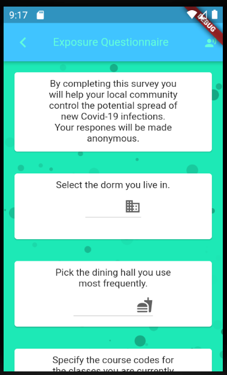

#  CurveStomp 
 
CurveStomp is a Flutter application designed to help communities adapt to the new normal through faciliating the prevention and detection of local COVID-19 spread, and sharing important information that pertrains to it.
## Table of Contents
* [General info](#general-info)
* [Features](#features)
* [Technologies Used](#technologies-used)
* [Screenshots](#screenshots)
* [Team](#team)
### General Info
This application is intended to help communities in their eventual recovery from the Coronavirus
pandemic. As school campuses and other similar institutions reopen, it will be essential to proceed
with caution and ensure that any spread is halted in its early phases. The application collects
relevant information from users, makes it anonymous and keeps track of any potentially affected individuals.
Through keeping track of what classes and public spaces the users share, the app can help relevant
authorities quickly act if an infection is confirmed so those potentially affected can take the
needed precautions.
### Features
(1) Symptoms quiz that can help establish if you potentially are infected with COVID-19. 
(2) The application collects data about which public spaces the user frequents where they might spread the infection to others. 
(3) General information about COVID-19, tips on how to handle life in the new normal and links to important resources. 

Hackathon Disclaimer: Since this app was done by a team of two during an online hackathon, many features are missing or not properly implemented. Below is a list of what our vision of the application is and how we hope to achieve it in the future. 
(1) IoT approach to infections. By keeping track of which connections (classes, e.t.c) users share, our app will be aware when a particular group was exposed to an infection. It would then be able to inform the school authorities or perhaps alert the affected users that they may need to self-isolate.  
(2) Bluetooth proximity tracking. Similiar to what was achieved in Korea, perhaps our application could tell the user if they have recently come in contact with an infected individual. 
(3) Firebase for logging in (probably through your school email). 
(4) Updating stream of tips and advice related to COVID-19. 
### Technologies Used
Front end is done in Flutter.
Back end is handled with Firebase.
To run the application you should clone the repository into Android Studio, install the Flutter and Dart SDK's if you don't have them already and then run the application.
### Screenshots

### Team
Mahmoud Alminawi - Drew U  
David Nesterov-Rappoport - Drew U  

